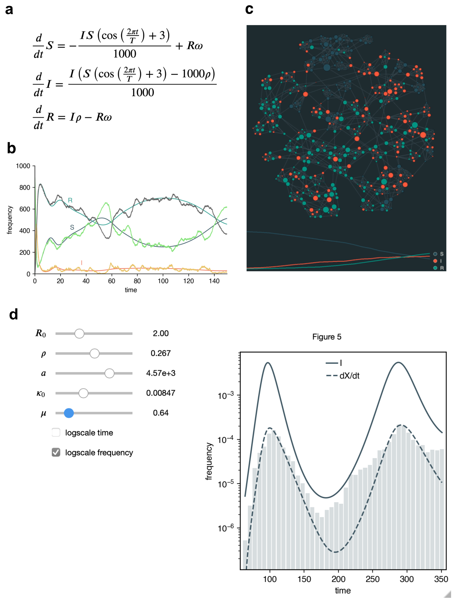

# Summary

Analyzing the spread of infectious diseases by means of mathematical models
has been an active area of research for almost 100 years
[@kermack_contributions_1991,@keeling_modeling_2011,@anderson_infectious_2010].
Since the emergence of the COVID-19 pandemic in early 2020, 
the field has seen yet another considerable boost in interest. Researchers,
journalists, and laymans alike have since been working on a
large number of different models that are supposed to forecast case numbers,
to analyze the implications of different contact structures between individual people, or to discuss
the influence of various mitigation and containment strategies, to only name a few applications [@estrada_covid-19_2020].

The complexity of epidemiological models often mitigates simple replication
and/or adaption to local circumstances.
Typically, modifications are quickly thought up, but their influence on system properties such as the 
epidemic threshold or outbreak size are less clear.
Variations in model formulation often entail the
reimplementation of simulation and analysis frameworks for every model iteration,
taking up valuable time and resources for debugging and reanalysis.
Furthermore, researchers often need to cross-check their results by implementing both
deterministic well-mixed models and models that consider explicit contact structures
(i. e. static or temporal networks). Last but not least, analytical derivations are often done in separate computer algebra systems.

To date and to the best of our knowledge, no open source software that adequately integrates solutions to all of these problems exists.

*epipack* solves the raised issues by offering a simple, process-based
framework that allows researchers to quickly prototype any compartmental epidemiological model
and to investigate its behavior based on analytical, numerical, stochastical,
and agent-based/network-based simulations.

*epipack* provides four base classes to accomodate building models for different analysis methods:

* EpiModel: Define a model based on transition, birth, 
  death, fission, fusion, or transmission reactions for integrating the 
  ordinary differential equations (ODEs) of the corresponding well-mixed system
  numerically or simulate it using Gillespie's algorithm [@gillespie_exact_1977].
  Process rates can be numerical functions of time and the system state.
* SymbolicEpiModel: Define a model based on transition, birth, 
  death, fission, fusion, or transmission reactions. Obtain the ODEs,
  fixed points, Jacobian, and the Jacobian's eigenvalues at fixed points
  as symbolic expressions using sympy [@meurer_sympy_2017]. 
  Process rates can be symbolic expressions of time and the system state.
  Set numerical parameter values and integrate the ODEs numerically, or
  simulate the stochastic systems using Gillespie's algorithm [@gillespie_exact_1977].
* StochasticEpiModel: Define a model based on node transition and
  link transmission reactions. Add conditional link transmission reactions.
  Simulate your model on any (un-/)directed, (un-/)weighted static/temporal
  network, or in a well-mixed system. We make use of a generalized
  version of the tree-based rejection sampling algorithm presented in ref. [@guillaume]
  and the accompanying implementation of SamplableSet [@st-onge_samplableset_nodate]. These
  algorithms are based on the correct continuous-time simulations, as 
  discrete-time approximative simulation algorithms are known to behave problematically
  [@givan_predicting_2011, @maier_spreading_2020]
* MatrixEpiModel: A static-rate version of the EpiModel class that runs faster
  on complex models (e. g. reaction-diffusion systems) by making use
  of scipy's implementation of sparse matrices [@virtanen_scipy_2020].

We further provide a simple visualization framework to animate
stochastic simulations on networks, lattices, well-mixed systems,
or reaction-diffusion systems.
The research process is further
facilitated by interactive analysis widgets
that give immediate visual feedback
regarding a system's inner workings.

While other infectious disease modeling frameworks exist,
most are fixed to a limited number of models, specialized for either ODE or network systems,
or are published under a proprietary license [@broeck_gleamviz_2011].

To the best of our knowledge, *epipack* is the first open source software suite
that offers extensive model building and analysis frameworks for both mean-field as well
as networks models with a simple and intuitive API.
It therefore presents a valuable tool for researchers
in the infectious diseases modeling community.

# Acknowledgments

BFM is financially supported as an *Add-On Fellow for Interdisciplinary Life Science* by the Joachim Herz Stiftung. BFM wants to thank A. Burdinski and K. Ledebur for valuable feedback as well as J. S. Juul for the productive collaboration on a code base that heavily inspired this project.

# References
